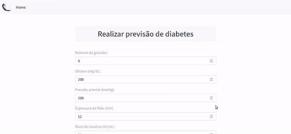
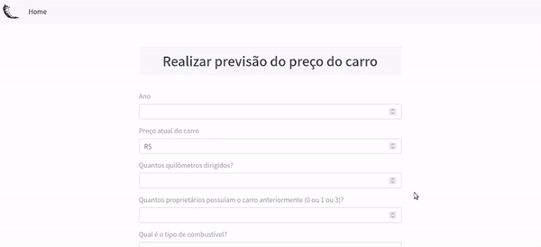
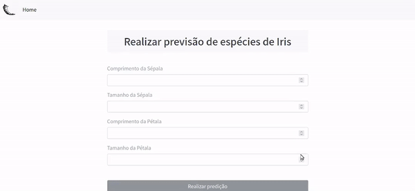

## 💻 Sobre

:speech_balloon: Repositório contendo projetos simples de Machine Learning, utilizando [Python](https://www.python.org/) e [Flask](https://flask.palletsprojects.com/en/2.0.x/). 

<br>

##  🛠️ Categorias 

O repositório é divido em duas categorias 


### 📌 ml_prediction_projects 
Projetos voltados predição.

### 📌 knn_recommendation_projects 
Projetos voltados a sistemas de recomendação com base no algoritmo kNN (K-nearest neighbors).

### 📌 ml_interactive_maps
Projetos voltados a mapas interativos.

<br>

## 🎨 Layout dos sistemas de predição

<p align="center" style="display: flex; align-items: flex-start; justify-content: center;">
  
</p>

<p align="center" style="display: flex; align-items: flex-start; justify-content: center;">
  
</p>

<p align="center" style="display: flex; align-items: flex-start; justify-content: center;">
  
</p>

<br>

## 🚀 Como executar o projeto

### Pré-requisitos

Antes de começar, você vai precisar ter instalado em sua máquina as seguintes ferramentas:
[Git](https://git-scm.com), [Python](https://www.python.org/).

<br>

#### 🧭 Rodando a aplicação

```bash

# Clone esse repositório
$ git clone https://github.com/savio-2-lopes/Prediction-ML-Projects.git

# Acesse a pasta 
$ cd Prediction-ML-Projects

# Caso não esteja em ambiente virtual, certifique-se de criá-lo dentro da pasta (em Linux/macOS) e ativá-lo
$ python3 -m venv venv
$ . venv/bin/activate

# Para criar o ambiente virtual em Windows e ativá-lo, utilize o comando abaixo
$ py -3 -m venv venv
$ venv\Scripts\activate

# Após isso, instale as depedências
$ pip install -r requirements.txt

```

<br>

## 📚 Datasets

Para os sistemas de recomendação, foram utilizados duas bases de dados:

- [Book-Crossing Dataset](http://www2.informatik.uni-freiburg.de/~cziegler/BX/)
- [MovieLens Dataset](https://grouplens.org/datasets/movielens/)