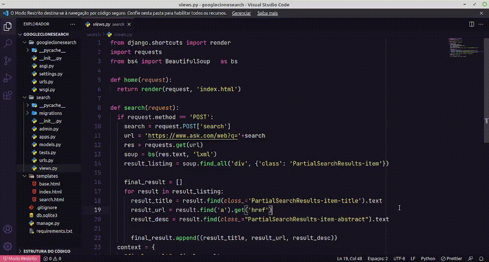

# Simples Clone do Mecanismo de Busca do Google em Django

Simples clone funcional do mecanismo de busca do Google em Django, que utiliza o pacote Beautiful Soup para extrair os dados com base no url do mecanismo de busca Ask.com.

<p align="center" style="display: flex; align-items: flex-start; justify-content: center;">
  
</p>

<br>

## 🚀 Como executar o projeto

### Pré-requisitos

Antes de começar, você vai precisar ter instalado em sua máquina as seguintes ferramentas:
[Git](https://git-scm.com), [Python](https://www.python.org/).

<br>

#### 🧭 Rodando a aplicação

```bash

# Clone esse repositório
$ git clone https://github.com/savio-2-lopes/Prediction-ML-Projects.git

# Acesse a pasta
$ cd Prediction-ML-Projects/googleclonesearch

# Caso não esteja em ambiente virtual, certifique-se de criá-lo dentro da pasta (em Linux/macOS) e ativá-lo
$ python3 -m venv venv
$ . venv/bin/activate

# Para criar o ambiente virtual em Windows e ativá-lo, utilize o comando abaixo
$ py -3 -m venv venv
$ venv\Scripts\activate

# Após isso, instale as depedências
$ pip install -r requirements.txt

# Após isso inicie a aplicação
$ python3 manage.py runserver

```
